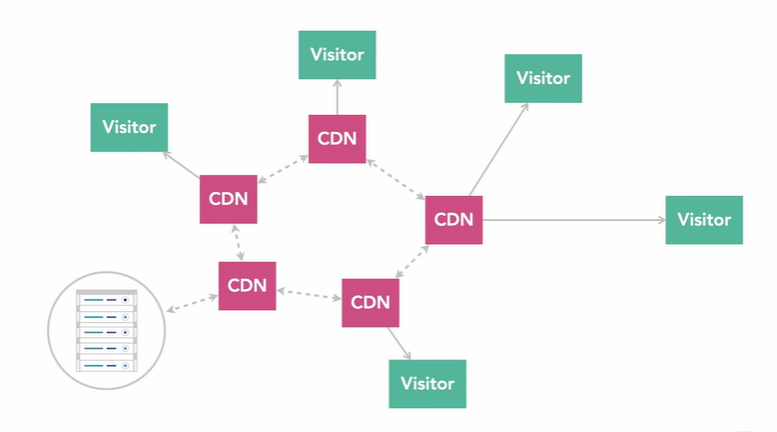

## 7. Optimize Delivery

### Compress data with Gzip and Brotli

Compress all files at server level:
[h5bp/server-configs](https://github.com/h5bp/server-configs)

- Gzip

  - Established standard for the web
  - Fast compression
  - Many hosts automatically Gzip assets delivery

- Brotli

  - Newer compression format
  - Higher, but slower (a lot slower) compression
  - Must be done manually before uploading to the server

### Server push

- Server Push Using Link Header

  Link: `</css/styles.css>`; rel=preload; as=style.``; rel=preload; as=image

### [preload vs. prefetch](https://www.keycdn.com/blog/resource-hints#:~:text=preload%20is%20different%20from%20prefetch,block%20the%20window's%20onload%20event.)

- preload

  Triggers priority loading
  Asset is stored in cache for immediate use
  Is jumping out of loading queue

  - Critical assets
  - Must be available as soon as possible
  - Is prioritized over fetches

- prefetch

  Trigger low-priority loading
  Asset is stored in cache for immediate use
  Browser may abandon a prefetch due to bandwidth constraints etc.

  - Non-critical asset
  - Can be useful to have available
  - Low priority
  - May not happen prefetch because bandwidth

### Browser caching

- Automatic Browser Caching

  - CSS
  - JavaScript
  - Images

- Specify your caching strategy
	- Client-Side caching
		- runtime caching
		- sessionStorage
		- persistence caching
			- cookie
			- localStorage
			- indexedDB (offline caching?)
	- Server-Side caching
		- server runtime caching
		- redis?mongoDB?
	- Etc.
- Work with server side: [h5bp/server-configs](https://github.com/h5bp/server-configs)

### CDNs(Content Delivery Network)

**Without CDN:**  
every visitor has to get files from your server

**With CDN:**  
The CDN grabs a copy of your site, caches it and distributes it to all of its distributed servers, and the visitor gets a copy from whatever CDN server is closest to them.  
The way, the use gets much faster access to your sites and the load on you hosting provider is far less server.  
Many CDNs also automate do some of the optimizations.  
Do some jobs more efficient then at client side.  
Offload a lot of traffic from your web host.

- Auto-compression of assets including images, CSS, and JS
- Automatic modernization of images with WebP
- DDoS protection
- Advanced caching

***
## <<< [Improve Web Performance](../README.md)
*** 